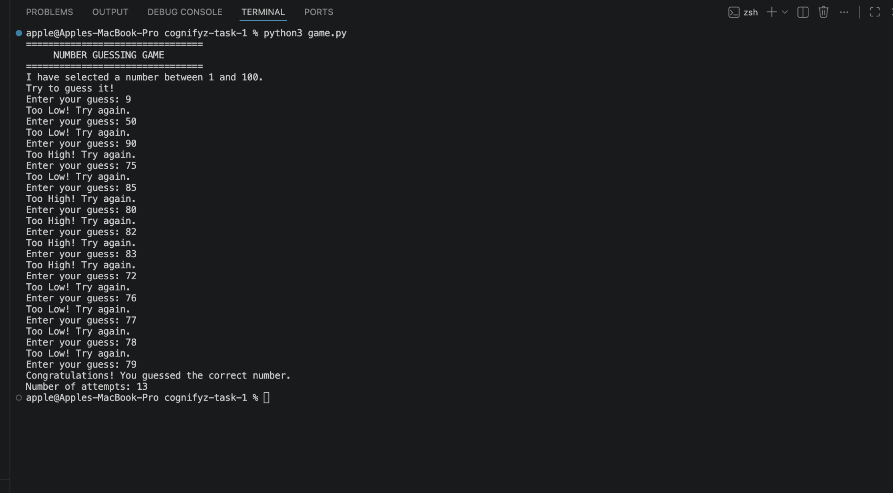

# Cognifyz Task 1 - Number Guessing Game

A basic text-based Number Guessing Game developed in Python as part of the Cognifyz Software Development Internship.

## Features

- Generates a random number between 1 and 100
- Provides Too High / Too Low hints
- Counts the number of attempts
- Shows a success message when the correct number is guessed

## Technologies Used

- Python
- Random module

## Output Screenshot

